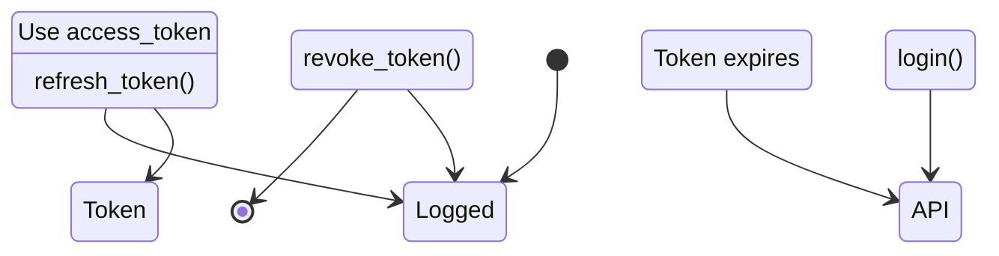

# Authentication

Manage user authentication, access tokens, and secure sessions with the Account API.

## Authentication Methods

Cerevox supports two authentication methods:

<CardGroup cols={2}>
  <Card title="API Key (Recommended)" icon="key">
    **Best for**: Server-side applications, scripts, automation

    ```python
    from cerevox import Hippo, Lexa

    # Use API key directly
    hippo = Hippo(api_key="your-api-key")
    lexa = Lexa(api_key="your-api-key")
    ```

    **Get API key**: [cerevox.ai](https://cerevox.ai)
  </Card>

  <Card title="OAuth Tokens" icon="shield-halved">
    **Best for**: User-facing applications, mobile apps, web apps

    ```python
    from cerevox import Account

    account = Account()

    # Login to get tokens
    auth = account.login(email, password)

    # Use access token
    hippo = Hippo(access_token=auth.access_token)
    ```

    **Use case**: Multi-user applications
  </Card>
</CardGroup>

## OAuth Authentication Flow

### 1. Login

<CodeGroup>
```python Sync
from cerevox import Account

account = Account()

# Login with email/password
auth_response = account.login(
    email="user@example.com",
    password="secure-password"
)

print(f"Access Token: {auth_response.access_token}")
print(f"Refresh Token: {auth_response.refresh_token}")
print(f"Expires In: {auth_response.expires_in} seconds")
print(f"Token Type: {auth_response.token_type}")
```

```python Async
from cerevox import AsyncAccount

async with AsyncAccount() as account:
    auth = await account.login(
        email="user@example.com",
        password="password"
    )

    print(f"Access Token: {auth.access_token}")
```
</CodeGroup>

**Response fields:**
- `access_token`: Short-lived token for API requests (1 hour)
- `refresh_token`: Long-lived token to get new access tokens (30 days)
- `expires_in`: Seconds until access token expires
- `token_type`: Token type (usually "Bearer")

### 2. Use Access Token

```python
from cerevox import Hippo, Lexa

# Use access token with any Cerevox API
hippo = Hippo(access_token=auth_response.access_token)
lexa = Lexa(access_token=auth_response.access_token)

# Make API calls
folder = hippo.create_folder("My Docs")
documents = lexa.parse(["doc.pdf"])
```

### 3. Refresh Token

Access tokens expire after 1 hour. Refresh before expiry:

<CodeGroup>
```python Sync
# Refresh to get new access token
new_auth = account.refresh_token(
    refresh_token=auth_response.refresh_token
)

print(f"New Access Token: {new_auth.access_token}")
print(f"Expires In: {new_auth.expires_in} seconds")
```

```python Async
new_auth = await account.refresh_token(
    refresh_token=auth_response.refresh_token
)
```
</CodeGroup>

### 4. Revoke Token (Logout)

<CodeGroup>
```python Sync
# Revoke token to log out
account.revoke_token(token=auth_response.access_token)

print("Logged out successfully")
```

```python Async
await account.revoke_token(token=auth_response.access_token)
```
</CodeGroup>

<Warning>
  After revoking, the access token can no longer be used for API requests.
</Warning>

## Complete Authentication Flow

```python
from cerevox import Account, Hippo
import time

class AuthManager:
    def __init__(self):
        self.account = Account()
        self.auth_response = None

    def login(self, email, password):
        """Login and store tokens"""
        self.auth_response = self.account.login(email, password)

        # Calculate expiry time
        self.auth_response.expires_at = (
            time.time() + self.auth_response.expires_in
        )

        print(f"✅ Logged in as {email}")
        return self.auth_response

    def get_valid_token(self):
        """Get valid access token, refreshing if needed"""
        # Check if token expires within 5 minutes
        if time.time() > self.auth_response.expires_at - 300:
            print("🔄 Refreshing token...")

            self.auth_response = self.account.refresh_token(
                self.auth_response.refresh_token
            )

            self.auth_response.expires_at = (
                time.time() + self.auth_response.expires_in
            )

            print("✅ Token refreshed")

        return self.auth_response.access_token

    def logout(self):
        """Revoke token and log out"""
        self.account.revoke_token(self.auth_response.access_token)
        self.auth_response = None
        print("✅ Logged out")

# Usage
auth_manager = AuthManager()

# Login
auth_manager.login("user@example.com", "password")

# Use with Hippo
hippo = Hippo(access_token=auth_manager.get_valid_token())
folder = hippo.create_folder("My Docs")

# Token automatically refreshes when needed
time.sleep(3600)  # Wait 1 hour
hippo = Hippo(access_token=auth_manager.get_valid_token())  # Auto-refreshes

# Logout when done
auth_manager.logout()
```

## Secure Token Storage

<Warning>
  **Never** store tokens in:
  - Source code
  - Version control (git)
  - Client-side storage (localStorage, cookies without security)
  - Plain text files
</Warning>

### Recommended: Environment Variables

```python
import os

# Store tokens in environment variables
os.environ['CEREVOX_ACCESS_TOKEN'] = auth_response.access_token
os.environ['CEREVOX_REFRESH_TOKEN'] = auth_response.refresh_token

# Retrieve when needed
access_token = os.getenv('CEREVOX_ACCESS_TOKEN')
```

### Recommended: Secure Keyring

```python
import keyring

# Store tokens securely in system keyring
keyring.set_password("cerevox", "access_token", auth_response.access_token)
keyring.set_password("cerevox", "refresh_token", auth_response.refresh_token)

# Retrieve when needed
access_token = keyring.get_password("cerevox", "access_token")
refresh_token = keyring.get_password("cerevox", "refresh_token")
```

### Server-Side Sessions

```python
from flask import Flask, session

app = Flask(__name__)
app.secret_key = 'your-secret-key'  # Use secure random key

@app.route('/login', methods=['POST'])
def login():
    # Login
    auth = account.login(email, password)

    # Store in server-side session
    session['access_token'] = auth.access_token
    session['refresh_token'] = auth.refresh_token
    session['expires_at'] = time.time() + auth.expires_in

    return "Logged in"

@app.route('/api/data')
def get_data():
    # Use token from session
    access_token = session.get('access_token')

    hippo = Hippo(access_token=access_token)
    # ... use hippo ...
```

## Error Handling

```python
from cerevox import Account, AccountError

account = Account()

try:
    auth = account.login(email="user@example.com", password="wrong-password")

except AccountError as e:
    if "invalid credentials" in str(e).lower():
        print("Error: Invalid email or password")
    elif "account locked" in str(e).lower():
        print("Error: Account locked due to too many failed attempts")
    elif "not found" in str(e).lower():
        print("Error: Account not found")
    else:
        print(f"Error: {e}")

# Token expiry handling
try:
    hippo = Hippo(access_token=expired_token)
    folder = hippo.create_folder("Test")

except AccountError as e:
    if "token expired" in str(e).lower():
        # Refresh token
        new_auth = account.refresh_token(refresh_token)
        hippo = Hippo(access_token=new_auth.access_token)

        # Retry operation
        folder = hippo.create_folder("Test")
```

## Token Lifecycle

<Steps>
  <Step title="Login">
    User provides credentials → Receive access + refresh tokens
  </Step>
  <Step title="Use Access Token">
    Include access token in API requests (valid for 1 hour)
  </Step>
  <Step title="Refresh Token">
    Before expiry, use refresh token to get new access token
  </Step>
  <Step title="Logout">
    Revoke access token when user logs out
  </Step>
</Steps>



## Multi-User Application Example

```python
from cerevox import Account, Hippo
from flask import Flask, request, session, jsonify

app = Flask(__name__)
app.secret_key = 'secure-random-key'

account = Account()

@app.route('/auth/login', methods=['POST'])
def login():
    """User login endpoint"""
    data = request.json

    try:
        auth = account.login(
            email=data['email'],
            password=data['password']
        )

        # Store in session
        session['access_token'] = auth.access_token
        session['refresh_token'] = auth.refresh_token
        session['expires_at'] = time.time() + auth.expires_in

        return jsonify({'message': 'Logged in successfully'})

    except Exception as e:
        return jsonify({'error': str(e)}), 401

@app.route('/auth/logout', methods=['POST'])
def logout():
    """User logout endpoint"""
    try:
        # Revoke token
        account.revoke_token(session['access_token'])

        # Clear session
        session.clear()

        return jsonify({'message': 'Logged out successfully'})

    except Exception as e:
        return jsonify({'error': str(e)}), 400

def get_valid_token():
    """Helper to get valid access token"""
    # Check if token expires soon
    if time.time() > session.get('expires_at', 0) - 300:
        # Refresh token
        auth = account.refresh_token(session['refresh_token'])

        # Update session
        session['access_token'] = auth.access_token
        session['expires_at'] = time.time() + auth.expires_in

    return session['access_token']

@app.route('/api/folders', methods=['POST'])
def create_folder():
    """Protected endpoint - requires authentication"""
    try:
        # Get valid token
        access_token = get_valid_token()

        # Use with Hippo
        hippo = Hippo(access_token=access_token)
        folder = hippo.create_folder(request.json['name'])

        return jsonify({
            'id': folder.id,
            'name': folder.name
        })

    except Exception as e:
        return jsonify({'error': str(e)}), 400

if __name__ == '__main__':
    app.run()
```

## Best Practices

<AccordionGroup>
  <Accordion icon="clock" title="Proactive Token Refresh">
    Refresh tokens **before** they expire:

    ```python
    # ✅ Good - Refresh 5 minutes before expiry
    if time.time() > expires_at - 300:
        auth = account.refresh_token(refresh_token)

    # ❌ Bad - Wait until token expires
    try:
        hippo.create_folder("Test")
    except:
        auth = account.refresh_token(refresh_token)
    ```

    Prevents failed requests due to expiry
  </Accordion>

  <Accordion icon="shield" title="Secure Credential Handling">
    ```python
    # ✅ Good
    password = os.getenv('USER_PASSWORD')
    access_token = keyring.get_password("cerevox", "token")

    # ❌ Bad
    password = "hardcoded-password"
    access_token = "sk_live_abc123..."
    ```

    Never hardcode credentials!
  </Accordion>

  <Accordion icon="user-lock" title="Implement Logout">
    Always provide logout functionality:

    ```python
    def logout():
        # Revoke token
        account.revoke_token(access_token)

        # Clear stored tokens
        session.clear()
        # or
        keyring.delete_password("cerevox", "access_token")
    ```

    Prevents unauthorized access after user leaves
  </Accordion>

  <Accordion icon="rotate" title="Handle Token Refresh Failures">
    ```python
    try:
        auth = account.refresh_token(refresh_token)
    except AccountError:
        # Refresh token expired or revoked
        # Force user to log in again
        redirect_to_login()
    ```

    Gracefully handle expired refresh tokens
  </Accordion>
</AccordionGroup>

## Security Checklist

<Check>
  - [ ] Use HTTPS for all API requests
  - [ ] Never commit API keys or tokens to version control
  - [ ] Store tokens securely (keyring, encrypted storage)
  - [ ] Implement token refresh before expiry
  - [ ] Provide logout functionality
  - [ ] Handle authentication errors gracefully
  - [ ] Use environment variables for secrets
  - [ ] Implement rate limiting on login endpoint
  - [ ] Log authentication events for security monitoring
</Check>

## Next Steps

<CardGroup cols={2}>
  <Card
    title="Usage Tracking"
    icon="chart-line"
    href="/account/usage-tracking"
  >
    Monitor API usage and billing
  </Card>
  <Card
    title="Account Overview"
    icon="user"
    href="/account/overview"
  >
    Back to Account API overview
  </Card>
</CardGroup>
