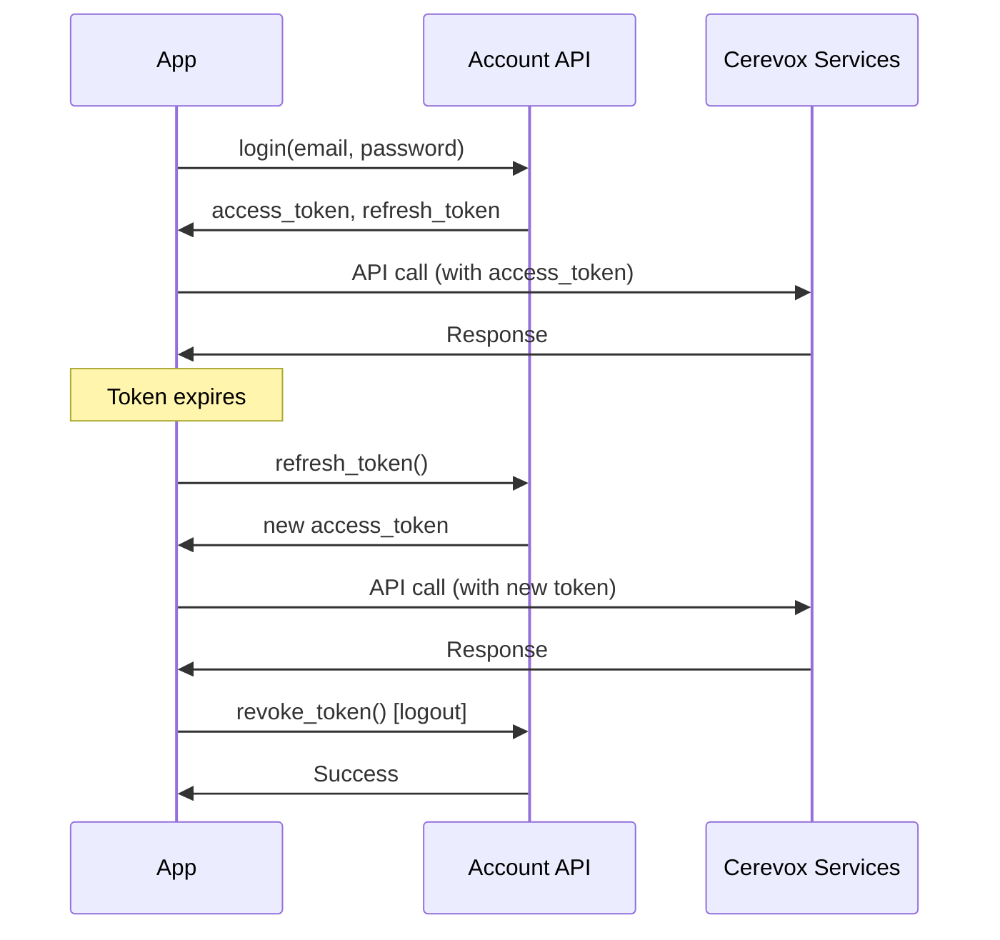

# Account Management API

Manage authentication, users, and usage tracking for your Cerevox account.

## What is the Account API?

The **Account API** provides enterprise-grade account operations:

<CardGroup cols={3}>
  <Card title="Authentication" icon="key">
    Login, refresh tokens, and secure session management
  </Card>
  <Card title="User Management" icon="users">
    Create, update, and manage users (admin operations)
  </Card>
  <Card title="Usage Tracking" icon="chart-line">
    Monitor API usage, costs, and billing information
  </Card>
</CardGroup>

## Core Features

### Authentication & Tokens

<CodeGroup>
```python Login
from cerevox import Account

account = Account()

# Login with credentials
response = account.login(
    email="user@example.com",
    password="secure-password"
)

print(f"Access Token: {response.access_token}")
print(f"Refresh Token: {response.refresh_token}")
print(f"Expires in: {response.expires_in} seconds")
```

```python Refresh Token
# Refresh access token before expiry
new_tokens = account.refresh_token(
    refresh_token=response.refresh_token
)

print(f"New Access Token: {new_tokens.access_token}")
```

```python Revoke Token
# Revoke token (logout)
account.revoke_token(token=response.access_token)

print("Token revoked successfully")
```
</CodeGroup>

### Account Information

<CodeGroup>
```python Get Account Info
# Get account details
info = account.get_account_info()

print(f"Account ID: {info.account_id}")
print(f"Email: {info.email}")
print(f"Plan: {info.plan}")
print(f"Status: {info.status}")
```

```python Async
from cerevox import AsyncAccount

async with AsyncAccount() as account:
    info = await account.get_account_info()
    print(f"Plan: {info.plan}")
```
</CodeGroup>

### Usage Monitoring

<CodeGroup>
```python Check Usage
# Get usage statistics
usage = account.get_usage()

print(f"API Calls: {usage.total_requests}")
print(f"Documents Processed: {usage.documents_processed}")
print(f"Questions Asked: {usage.questions_asked}")
print(f"Storage Used: {usage.storage_bytes} bytes")
```

```python Get Billing Info
# Check billing and costs
billing = account.get_billing_info()

print(f"Current Period: {billing.period_start} to {billing.period_end}")
print(f"Total Cost: ${billing.total_cost}")
print(f"Next Invoice: {billing.next_invoice_date}")
```
</CodeGroup>

## User Management (Admin)

<Note>
  **Admin only**: User management operations require admin privileges.
</Note>

<CodeGroup>
```python Create User
# Create new user (admin only)
new_user = account.create_user(
    email="newuser@example.com",
    role="member",
    name="New User"
)

print(f"Created user: {new_user.email}")
```

```python List Users
# Get all users in account (admin only)
users = account.list_users()

for user in users:
    print(f"{user.name} ({user.email}) - {user.role}")
```

```python Update User
# Update user role (admin only)
updated_user = account.update_user(
    user_id=user.id,
    role="admin"
)

print(f"Updated {updated_user.email} to {updated_user.role}")
```

```python Delete User
# Delete user (admin only)
account.delete_user(user_id=user.id)

print("User deleted successfully")
```
</CodeGroup>

## API Clients

<CodeGroup>
```python Synchronous
from cerevox import Account

# Best for: Scripts, notebooks, simple applications
account = Account(api_key="your-api-key")

info = account.get_account_info()
usage = account.get_usage()
```

```python Asynchronous
from cerevox import AsyncAccount
import asyncio

# Best for: Web servers, high-performance apps
async def main():
    async with AsyncAccount(api_key="your-api-key") as account:
        info = await account.get_account_info()
        usage = await account.get_usage()

        print(f"Plan: {info.plan}")
        print(f"API Calls: {usage.total_requests}")

asyncio.run(main())
```
</CodeGroup>

## Common Use Cases

<AccordionGroup>
  <Accordion icon="gauge" title="Monitor Usage & Costs">
    ```python
    from cerevox import Account

    account = Account()

    # Check usage
    usage = account.get_usage()

    # Alert if approaching limits
    if usage.total_requests > usage.rate_limit * 0.8:
        print("⚠️ Warning: Approaching rate limit!")
        print(f"Used: {usage.total_requests} / {usage.rate_limit}")

    # Check costs
    billing = account.get_billing_info()
    print(f"Current period cost: ${billing.total_cost}")
    ```

    **Benefit**: Proactive monitoring prevents surprises
  </Accordion>

  <Accordion icon="users" title="Team Management">
    ```python
    # Add team members (admin only)
    team_members = [
        {"email": "dev1@company.com", "role": "member"},
        {"email": "dev2@company.com", "role": "member"},
        {"email": "manager@company.com", "role": "admin"}
    ]

    for member in team_members:
        user = account.create_user(
            email=member["email"],
            role=member["role"]
        )
        print(f"Added: {user.email}")
    ```

    **Benefit**: Centralized team access management
  </Accordion>

  <Accordion icon="key" title="Secure Token Management">
    ```python
    # Login and store tokens securely
    auth = account.login(email, password)

    # Store in secure storage (not in code!)
    import keyring
    keyring.set_password("cerevox", "access_token", auth.access_token)
    keyring.set_password("cerevox", "refresh_token", auth.refresh_token)

    # Retrieve when needed
    access_token = keyring.get_password("cerevox", "access_token")
    ```

    **Benefit**: Secure credential management
  </Accordion>

  <Accordion icon="chart-bar" title="Usage Analytics">
    ```python
    import pandas as pd

    # Get usage over time
    usage_data = []

    for month in range(1, 13):
        usage = account.get_usage(
            start_date=f"2025-{month:02d}-01",
            end_date=f"2025-{month:02d}-28"
        )

        usage_data.append({
            'month': month,
            'requests': usage.total_requests,
            'cost': usage.estimated_cost
        })

    df = pd.DataFrame(usage_data)
    print(df)
    ```

    **Benefit**: Track trends and optimize usage
  </Accordion>
</AccordionGroup>

## Authentication Flow



## Response Models

### Account Info

```python
{
    'account_id': 'acc_123',
    'email': 'user@example.com',
    'name': 'John Doe',
    'plan': 'pro',                # free, pro, enterprise
    'status': 'active',           # active, suspended, cancelled
    'created_at': '2025-01-01T00:00:00Z',
    'features': {
        'hippo_enabled': True,
        'lexa_enabled': True,
        'max_users': 10
    }
}
```

### Usage Stats

```python
{
    'total_requests': 15420,
    'documents_processed': 230,
    'questions_asked': 1250,
    'storage_bytes': 524288000,   # ~500MB
    'rate_limit': 100000,
    'rate_limit_reset': '2025-02-01T00:00:00Z'
}
```

### Billing Info

```python
{
    'period_start': '2025-01-01',
    'period_end': '2025-01-31',
    'total_cost': 125.50,
    'currency': 'USD',
    'breakdown': {
        'hippo_cost': 75.00,
        'lexa_cost': 45.00,
        'storage_cost': 5.50
    },
    'next_invoice_date': '2025-02-01'
}
```

## Best Practices

<AccordionGroup>
  <Accordion icon="shield" title="Secure Credentials">
    **Never** hardcode credentials:
    ```python
    # ❌ Bad
    account = Account(api_key="sk_live_abc123...")

    # ✅ Good - Use environment variables
    import os
    account = Account(api_key=os.getenv("CEREVOX_API_KEY"))
    ```

    **Never** commit credentials to version control!
  </Accordion>

  <Accordion icon="clock" title="Token Refresh Strategy">
    ```python
    # Proactively refresh before expiry
    def get_valid_token(auth_response):
        import time

        # Check if token expires soon (within 5 minutes)
        if time.time() > auth_response.expires_at - 300:
            # Refresh token
            auth_response = account.refresh_token(
                auth_response.refresh_token
            )

        return auth_response.access_token
    ```
  </Accordion>

  <Accordion icon="chart-line" title="Monitor Usage Regularly">
    ```python
    # Daily usage check
    def check_daily_usage():
        usage = account.get_usage()

        # Check limits
        usage_percent = usage.total_requests / usage.rate_limit * 100

        if usage_percent > 80:
            notify_team(f"Usage at {usage_percent:.0f}%")

    # Schedule daily
    import schedule
    schedule.every().day.at("09:00").do(check_daily_usage)
    ```
  </Accordion>
</AccordionGroup>

## Error Handling

```python
from cerevox import Account, AccountError

account = Account()

try:
    info = account.get_account_info()
    print(f"Plan: {info.plan}")

except AccountError as e:
    if "authentication" in str(e).lower():
        print("Error: Invalid credentials")
    elif "forbidden" in str(e).lower():
        print("Error: Insufficient permissions")
    else:
        print(f"Error: {e}")
```

## Next Steps

<CardGroup cols={2}>
  <Card
    title="Authentication"
    icon="key"
    href="/account/authentication"
  >
    Complete authentication guide
  </Card>
  <Card
    title="Usage Tracking"
    icon="chart-line"
    href="/account/usage-tracking"
  >
    Monitor usage and billing
  </Card>
  <Card
    title="Hippo API"
    icon="hippo"
    href="/hippo/overview"
  >
    Use Hippo for RAG & retrieval
  </Card>
  <Card
    title="Lexa API"
    icon="file-lines"
    href="/lexa/overview"
  >
    Use Lexa for document parsing
  </Card>
</CardGroup>
